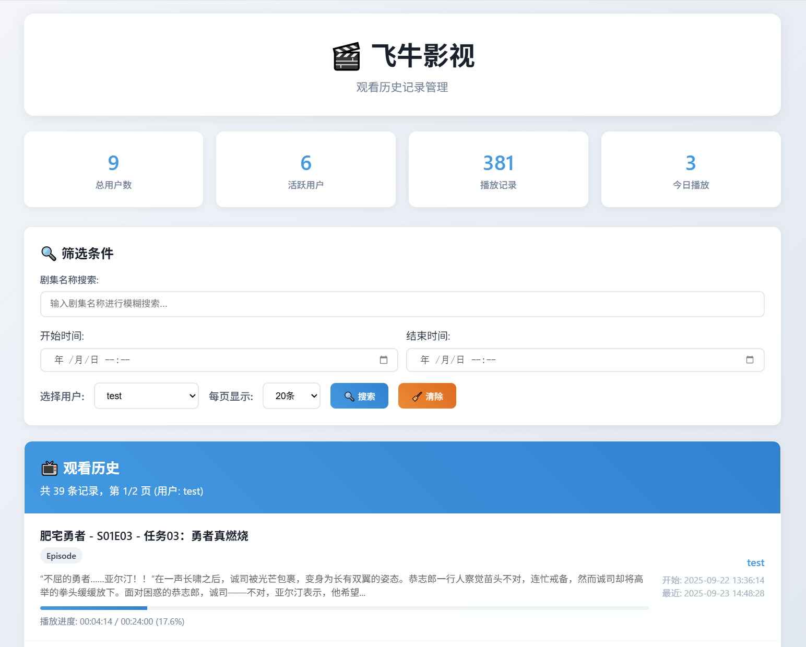

# 飞牛影视观看历史管理系统

🎬 一个专为飞牛影视数据库设计的观看历史记录管理系统



## ✨ 功能特性

- **现代化UI设计**：扁平化管理界面
- **观看历史展示**：按观看时间降序显示用户观看记录
- **用户筛选**：支持按用户筛选观看记录
- **完整层级展示**：
  - 自动获取完整的剧集层级信息（支持多级父子关系）
  - 智能显示剧集标题格式（剧名 - S01E01 - 集名）
  - 层级信息悬浮提示
- **详细信息显示**：
  - 播放进度条和百分比
  - 播放时长和观看位置
  - 剧集信息（季数、集数）
  - 视频分辨率和类型
  - 开始和最后播放时间
- **统计数据**：
  - 总用户数、活跃用户、播放记录数
  - 今日播放次数
- **响应式设计**：支持桌面和移动端访问
- **只读安全**：仅读取数据库，不进行任何写入操作

### 🐳 Docker Compose 部署（推荐）

使用 Docker Compose 可以更简单地部署和管理应用。

#### 前置条件

- Docker 和 Docker Compose
- 飞牛影视数据库文件目录

#### 部署步骤

1. 克隆项目：

```bash
git clone https://github.com/QiaoKes/fntv-record-view
cd fntv-record-view
```

2. 按需修改 docker-compose.yml 中的参数：
3. 启动服务：

```bash
docker-compose up -d
```

4. 查看运行状态：

```bash
docker-compose ps
docker-compose logs -f fntv-record-view
```

5. 访问应用：
   打开浏览器访问 `http://localhost:5000`

#### 注意事项

- 确保数据库目录路径正确且Docker有读取权限
- 默认端口为5000，可在docker-compose.yml中修改
- 确认挂载的飞牛影音数据库路径正确

## 📊 界面展示

### 主要功能区域

1. **统计卡片**：显示系统概览数据
2. **筛选控件**：用户选择和显示数量设置
3. **播放历史列表**：详细的观看记录展示
4. **分页导航**：支持大量数据的分页浏览

### 显示信息

- 📺 媒体标题（自动识别剧集格式：剧名 - S01E01 - 集名）
- 👤 观看用户名
- ⏱️ 播放进度（时分秒格式 + 百分比进度条）
- 🎬 媒体类型（电影/电视剧/动漫等）
- 📅 开始观看时间和最后播放时间
- 🎥 视频分辨率信息

## 🔧 技术实现

### 后端 (Flask)

- **路由设计**：

  - `/` - 主页面
  - `/api/users` - 用户列表 API
  - `/api/stats` - 统计数据 API
  - `/api/play_history` - 播放历史 API
  - `/api/user_activity` - 用户活动统计 API
- **数据处理**：

  - 时间戳格式化
  - 播放进度计算
  - 递归CTE查询获取完整层级信息
  - 缓存优化减少数据库查询
  - 分页数据处理
- **安全特性**：

  - 只读模式数据库连接 (`mode=ro`)
  - 递归深度限制防止死循环
  - 错误处理和日志记录

### 🐳 容器化部署

- **Docker 镜像**：

  - 基于 Python 3.13-alpine 镜像构建
  - 极简化配置，无额外系统依赖
  - 轻量级镜像，快速启动
- **Docker Compose 配置**：

  - 自动重启策略
  - 资源使用限制（内存 50M-100M，CPU 0.5-1.0）
  - 网络隔离（桥接网络）
  - 数据库只读挂载
  - 日志文件持久化

### 前端 (HTML/CSS/JavaScript)

- **现代化CSS**：

  - 渐变背景和毛玻璃效果
  - 卡片式布局设计
  - 响应式网格系统
  - 平滑过渡动画
  - 悬浮提示增强交互
- **交互功能**：

  - 异步数据加载
  - 实时筛选和分页
  - 加载状态显示
  - 错误状态处理
  - 自然页面滚动（移除内部滚动条）
- **数据展示优化**：

  - 智能层级信息显示
  - 剧集标题格式化
  - 进度条可视化
  - 响应式卡片布局

## 📱 移动端适配

- 响应式布局自动适应不同屏幕尺寸
- 移动端优化的交互元素
- 触摸友好的按钮和控件

## ⚠️ 注意事项

- **只读模式**：应用程序仅读取数据库，不会进行任何修改
- **数据安全**：确保数据库文件路径正确且可读
- **性能考虑**：大量数据时建议适当调整每页显示数量

## 📄 许可证

本项目基于 MIT 许可证开源。
飞牛影视媒体观看记录查看器
